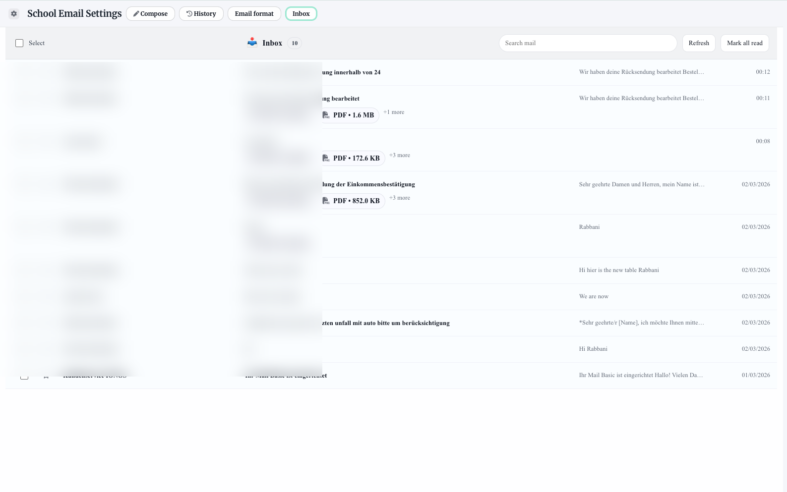
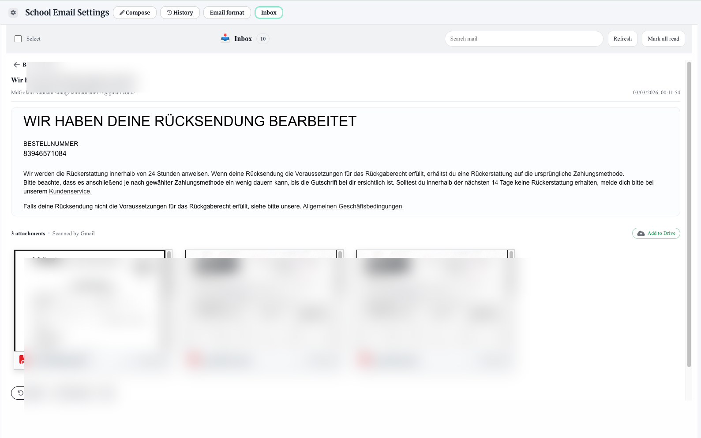
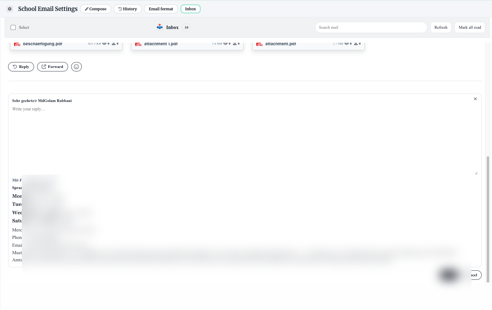
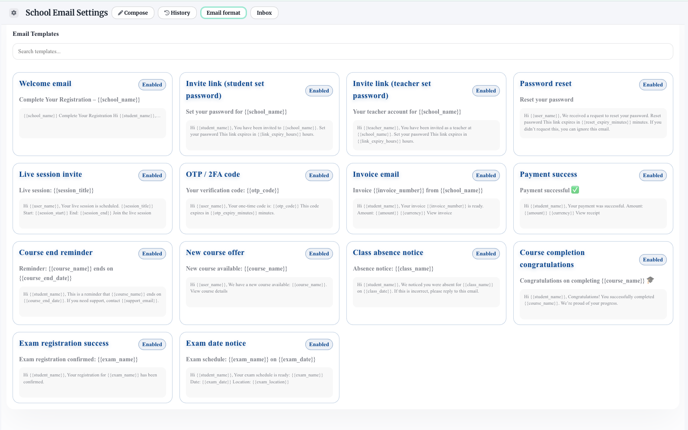
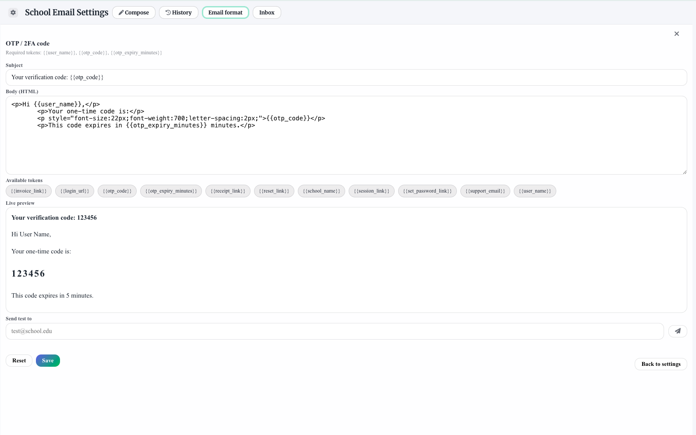
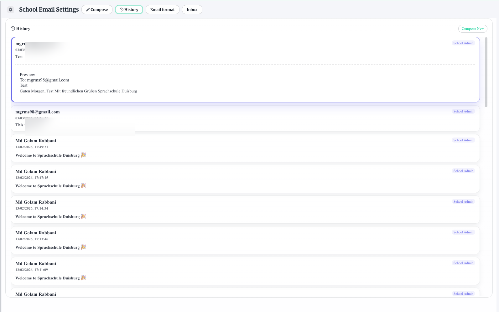
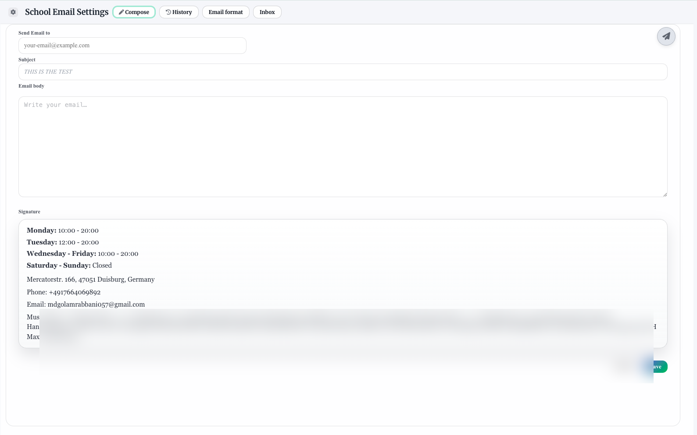

# 🎓 WorkNest – AI-Powered Language School SaaS Platform

WorkNest is a multi-tenant SaaS platform designed for language schools.  
It provides live classes, AI voice practice, task management, announcements, billing control, and a full admin moderation system.

Built as a full-stack application using Node.js, Express, and modern frontend architecture.

---

## 🚀 Features

### 👥 Multi-Tenant Architecture
- Workspace (school) isolation
- Role-based access (student, teacher, admin, super_admin)
- JWT authentication + refresh tokens
- CSRF protection

### 🎥 Live Classes
- Jitsi Meet integration
- JWT-secured rooms
- Slide deck support
- Real-time slide state synchronization
- Attendance tracking

### 🤖 AI Voice Practice
- Speech-based AI practice module
- Token-based usage tracking
- Runtime billing calculation
- Monthly AI budget caps per workspace
- Admin override system

### 📢 Communication
- Announcements system
- Channels & direct messaging
- Tasks & assignments
- Attendance records

### 💳 Billing System
- Invoice generation
- Payment tracking
- Workspace billing ledger
- AI cost tracking (EUR)
- Budget enforcement

### 🛡 Security
- Role-based authorization
- Login attempt tracking
- IP blocking
- Audit logs
- CSRF tokens
- Refresh token rotation

---

## 🏗 Architecture Overview

The platform follows a modular SaaS architecture:

Frontend:
- Vanilla JS SPA-style admin panel
- Dynamic state management
- Modular feature components

Backend:
- Node.js + Express
- REST API architecture
- Service-layer abstraction
- JWT-based authentication
- Multi-tenant workspace scoping

Database:
- Relational schema design
- Workspace-scoped entities
- AI usage ledger tables
- Audit trail tables

---

## 🧠 AI Budget System Design

The AI system includes:

- `ai_usage_ledger`
- `ai_runtime_sessions`
- `ai_budget_settings`
- Platform-level default caps
- Per-workspace overrides
- Automatic cost enforcement

Each AI interaction calculates:
- Token usage
- Runtime cost
- Total EUR consumption

When monthly cap is reached:
- AI usage is automatically blocked.

---

## 🎥 Live Class Architecture

- Jitsi Meet server integration
- Secure JWT room creation
- Slide deck upload system
- Slide state sync service
- PDF processing for slide preview

Flow:
1. Teacher creates live class
2. Server generates Jitsi JWT
3. Students join via secured room
4. Slide state synchronized across participants

---

## 🗄 Database Schema Highlights

Key tables:
- users
- workspaces
- channels
- tasks
- invoices
- payments
- ai_usage_ledger
- ai_runtime_sessions
- live_classes
- slide_decks
- slide_state
- audit_logs

---

## 🛠 Tech Stack

Backend:
- Node.js
- Express
- SQLite (dev) / PostgreSQL (recommended production)
- JWT
- bcrypt
- Nodemailer
- Twilio
- Jitsi Meet

Frontend:
- Vanilla JavaScript (SPA style)
- Custom CSS design system
- Responsive layout
- Accessible components

Infrastructure:
- Nginx (recommended)
- PM2 process manager
- HTTPS (production)

---

## 🔐 Security Design

- JWT + Refresh tokens
- CSRF protection
- Role-based access control
- Workspace isolation middleware
- Rate limiting
- Audit logs for admin actions

---
## ✉️ School Email Settings (Built-in Email Client + Templates)

Language schools can manage email directly inside the platform:

### Inbox + Email Client
- Inbox view with search, refresh, mark-all-read
- Read email with attachment previews
- Reply/forward inside the dashboard
- Email history tracking (sent messages)

### Email Templates System
- Template gallery with enable/disable switches
- Token-based templates (e.g. `{{user_name}}`, `{{otp_code}}`, `{{reset_link}}`)
- Live preview rendering
- Test-send to a target email
- Templates included:
  - Welcome email
  - Student invite (set password)
  - Teacher invite (set password)
  - Password reset
  - Live session invite
  - OTP / 2FA code
  - Invoice email
  - Payment success
  - Course end reminder
  - New course offer
  - Class absence notice
  - Course completion congratulations
  - Exam registration success
  - Exam date notice
    
---
## 📷 Screenshots

### School Email Settings (Preview)


### Inbox


### Message Viewer + Attachments


### Reply Composer


### Templates Gallery


### Template Editor (OTP / 2FA)


### History


### Compose

## 📦 Installation

```bash
git clone https://github.com/yourusername/worknest.git
cd worknest
npm install
npm run dev
