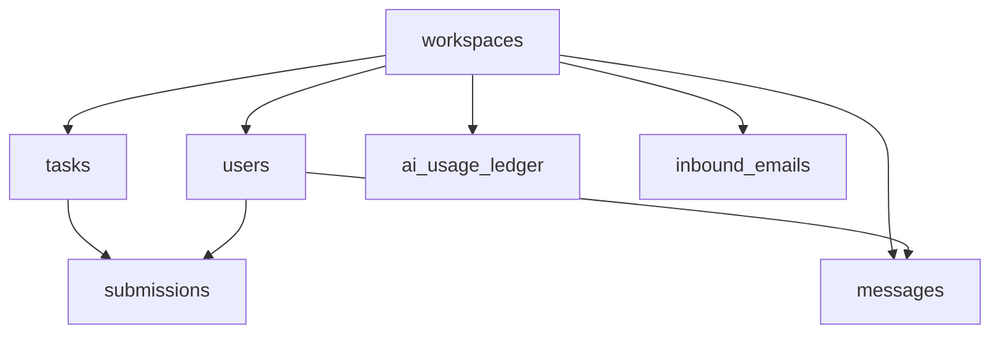

# Database Schema

StudiesTalk uses SQLite in WAL mode for development and testing. This supports concurrent reads and writes while keeping deployment simple. For production deployments, PostgreSQL remains the recommended target database.

## Core Tables

## Notes

- `users` stores account identity, role, phone data, and verification state.
- `workspaces` is the tenant boundary for schools.
- `tasks` and `submissions` cover assignment workflows.
- `messages` supports channel and direct-message communication.
- `ai_usage_ledger` tracks AI usage and billing data.
- `inbound_emails` stores received email metadata handled inside the platform.
