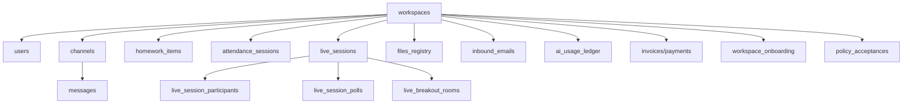

# Database Schema

StudiesTalk uses SQLite in WAL mode for development and current local runtime. PostgreSQL is the recommended staging/production database path.

This document is a current high-level map, not a complete DDL dump.

## Current core domains

### Tenant and identity

- `workspaces`
- `users`
- `workspace_members`
- `workspace_profile`
- `workspace_settings_admin`
- `registration_*`
- `refresh_tokens`
- `revoked_access_tokens`
- `password_history`
- `password_resets`
- `login_attempts`

### Messaging and channels

- `channels`
- `channel_members`
- `messages`
- `replies`
- `message_reactions`
- `message_reaction_users`
- `reply_reactions`
- `reply_reaction_users`
- `message_translations`
- `dms`
- `dm_members`
- `dm_messages`
- `dm_replies`
- DM reaction tables

### Homework, tasks, and attendance

- `tasks`
- `task_comments`
- `task_reactions`
- `homework_items`
- `homework_item_files`
- `homework_completions`
- `homework_submissions`
- `homework_submission_files`
- `homework_submission_comments`
- `attendance_sessions`
- `attendance_records`
- `attendance_notifications`
- `class_attendance`
- `class_attendance_records`

### Live classes

- `live_sessions`
- `live_session_participants`
- `live_attendance`
- `slide_state`
- `live_session_polls`
- `live_session_poll_options`
- `live_session_poll_responses`
- `live_breakout_rooms`
- `live_breakout_room_members`
- `live_session_recording`
- `live_session_recordings`

### Email and files

- `inbound_emails`
- `email_replies`
- `deleted_inbound_emails`
- `email_events`
- `workspace_email_logs`
- `workspace_email_settings`
- `workspace_email_templates`
- `files_registry`
- `file_events`
- `file_stats`

### AI, billing, and policy

- `ai_runtime_sessions`
- `ai_conversations`
- `ai_conversation_messages`
- `ai_usage_ledger`
- `ai_budget_settings`
- `workspace_billing`
- `invoices`
- `payments`
- `policy_acceptances`

### Onboarding and governance

- `workspace_onboarding`
- `workspace_onboarding_steps`
- `workspace_onboarding_events`
- `workspace_activation_metrics`
- `security_events`
- `audit_log`
- `audit_logs`
- `platform_settings`

## Relationship sketch

## Notes

- `workspaces` remains the tenant boundary.
- `users.workspace_id` and workspace-scoped tables carry most authorization boundaries.
- live classes now use `live_sessions` and `live_session_participants`, not an older `live_classes` abstraction.
- coursework now spans both `tasks` and `homework_*` tables.
- the platform stores both compatibility audit/security tables and current governance data.
- file lifecycle data is split between registry, events, and stats tables.

## Related docs

- [docs/database-cleanup.md](/Users/jannatuladny/cat-6.1/docs/database-cleanup.md)
- [docs/postgres-runtime-inventory.md](/Users/jannatuladny/cat-6.1/docs/postgres-runtime-inventory.md)
- [docs/postgresql-migration-plan.md](/Users/jannatuladny/cat-6.1/docs/postgresql-migration-plan.md)
